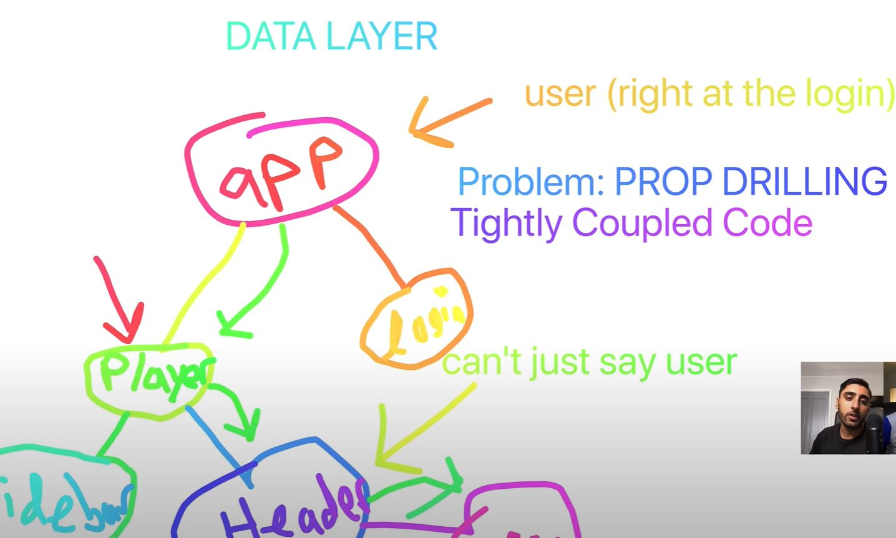
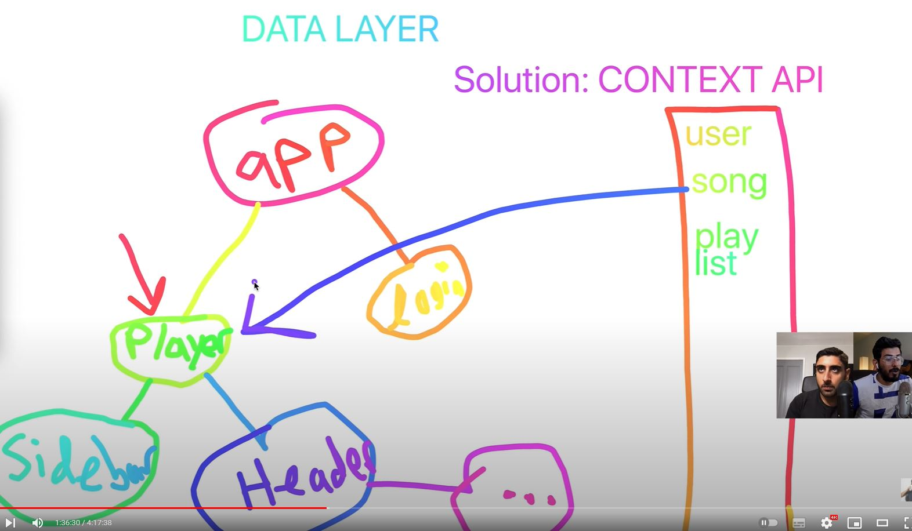

# Spotify clone

스포티파이 클론 유튭을 보고 따라하는 클론코딩 [🔴 Build a Spotify Clone with REACT JS for Beginners](https://youtu.be/pnkuI8KXW_8).

## Check 💥

새로이 알게된 포인트들을 여기에 업데이트 해 나갈 예정.

### `npm i spotify-web-api-js`

스포티파이와 리액트가 상호 커뮤니케이션 가능하게하는 api.

### `Data Layer and Context API`

 
keep parsing your props. 
header로 가고싶으면, 스포티파이에서 바로 app으로 갈수는 없음. 

app->player->header 이런식으로 가야함. 
이거를 **prop drilling**이라고 함. 
  
Thightly coupled code 
어떤 area에서 change가 발생하면 다른 other areas of code base를 break하면 안되는데, 
코드에 prop drilling이 많이 involved되면 change할 때마다 유리위를 밟는것과 같다 보면 됨. 
  
 
이러한 문제점을 fix하기 위해 많은 사람들이 **react context api**를 사용함. 
  
react context api를 사용하면, any point of tree던 directly하게 pull it 할 수 있음. 
extremely crucial한 부분이니까 context api 자세히 잘 들여다 볼 것.(amazone클론 보면 이 부분 좀더 자세히 알 수 있음). 
Redux랑 similar concept여서 CONTEXT API가 Data Layer링 어떻게 work하는지 한번 이해해두면 리덕스랑도 same thing할 수 있음.

React Context Api(most friendly and light weighted)로 start하면 이 패턴이 리덕스랑 플럭스와 비슷하기 때문에 무엇부터 dive into하는지 상관없음. 
So, level1이 Concept APi, level2가 Redux. 

### `https://mui.com/`

The React UI library you always wanted 
`npm install @mui/manpm install @mui/icons-material npm install @mui/icons-material`

<!--
Runs the app in the development mode.\
Open [http://localhost:3000](http://localhost:3000) to view it in your browser.

The page will reload when you make changes.\
You may also see any lint errors in the console.

### `npm test`

Launches the test runner in the interactive watch mode.\
See the section about [running tests](https://facebook.github.io/create-react-app/docs/running-tests) for more information.

### `npm run build`

Builds the app for production to the `build` folder.\
It correctly bundles React in production mode and optimizes the build for the best performance.

The build is minified and the filenames include the hashes.\
Your app is ready to be deployed!

See the section about [deployment](https://facebook.github.io/create-react-app/docs/deployment) for more information.

### `npm run eject`

**Note: this is a one-way operation. Once you `eject`, you can't go back!**

If you aren't satisfied with the build tool and configuration choices, you can `eject` at any time. This command will remove the single build dependency from your project.

Instead, it will copy all the configuration files and the transitive dependencies (webpack, Babel, ESLint, etc) right into your project so you have full control over them. All of the commands except `eject` will still work, but they will point to the copied scripts so you can tweak them. At this point you're on your own.

You don't have to ever use `eject`. The curated feature set is suitable for small and middle deployments, and you shouldn't feel obligated to use this feature. However we understand that this tool wouldn't be useful if you couldn't customize it when you are ready for it. -->

<!--
## Learn More

You can learn more in the [Create React App documentation](https://facebook.github.io/create-react-app/docs/getting-started).

To learn React, check out the [React documentation](https://reactjs.org/).

### Code Splitting

This section has moved here: [https://facebook.github.io/create-react-app/docs/code-splitting](https://facebook.github.io/create-react-app/docs/code-splitting)

### Analyzing the Bundle Size

This section has moved here: [https://facebook.github.io/create-react-app/docs/analyzing-the-bundle-size](https://facebook.github.io/create-react-app/docs/analyzing-the-bundle-size)

### Making a Progressive Web App

This section has moved here: [https://facebook.github.io/create-react-app/docs/making-a-progressive-web-app](https://facebook.github.io/create-react-app/docs/making-a-progressive-web-app)

### Advanced Configuration

This section has moved here: [https://facebook.github.io/create-react-app/docs/advanced-configuration](https://facebook.github.io/create-react-app/docs/advanced-configuration)

### Deployment

This section has moved here: [https://facebook.github.io/create-react-app/docs/deployment](https://facebook.github.io/create-react-app/docs/deployment)

### `npm run build` fails to minify

This section has moved here: [https://facebook.github.io/create-react-app/docs/troubleshooting#npm-run-build-fails-to-minify](https://facebook.github.io/create-react-app/docs/troubleshooting#npm-run-build-fails-to-minify) -->
